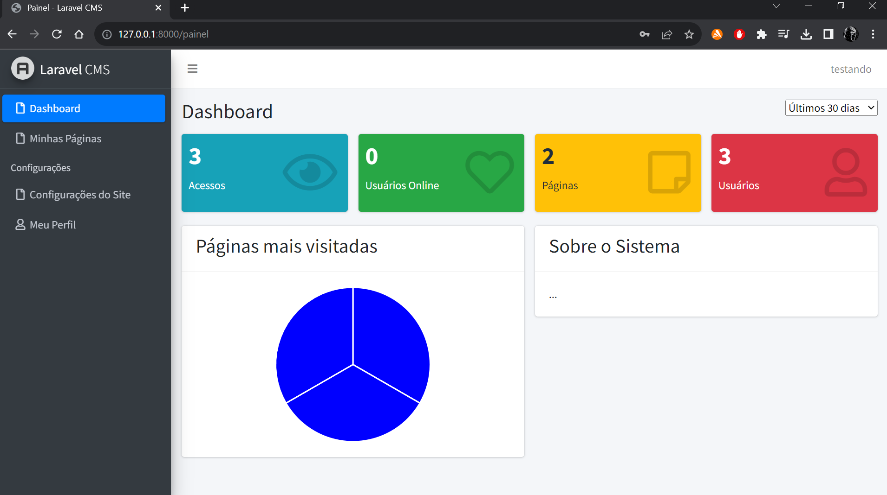
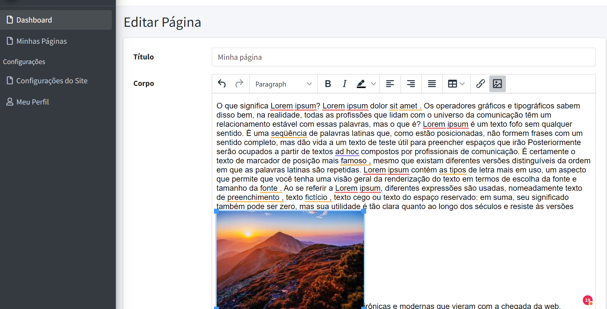

# LaravelCMS

O LaravelCMS é um sistema de gerenciamento de conteúdo desenvolvido com Laravel 6 e PHP 8.1. Ele permite a criação e edição de usuários e páginas com suporte ao editor TinyMCE para edição de texto e upload de imagens.

## 🚀 Visão Geral

O LaravelCMS é uma plataforma de gerenciamento de conteúdo simples e eficaz, desenvolvida com o poderoso framework Laravel. Ele foi projetado para facilitar a criação e gestão de conteúdo em sites de forma intuitiva e eficiente.

### Recursos

- Criação e edição de usuários
- Criação e edição de páginas
- Editor de texto TinyMCE para formatação avançada
- Suporte ao upload de imagens
- Banco de dados pré-configurado (dump pronto para uso)

# #🔧 Instalação

Para instalar o LaravelCMS, siga os seguintes passos:

1. Clone o repositório: `git clone https://github.com/bfrjunior/LaravelCMS.git`
2. Navegue até o diretório do projeto: `cd LaravelCMS`
3. Instale as dependências do composer: `composer install`
4. Copie o arquivo `.env.example` para `.env` e configure-o com suas informações de banco de dados.
5. Gere uma chave de aplicativo: `php artisan key:generate`
6. Execute as migrações do banco de dados: `php artisan migrate`
7. Inicie o servidor de desenvolvimento: `php artisan serve`

## Como Usar

1. Acesse o painel de administração em `http://seusite.com/admin` (ou o URL que você configurou).
2. Faça login com as credenciais padrão (você pode alterá-las posteriormente no painel de administração).
3. No painel de administração, você pode criar, editar e gerenciar usuários e páginas.
4. Use o editor TinyMCE para editar o conteúdo das páginas e fazer upload de imagens.

## Contribuição

Contribuições para o LaravelCMS são bem-vindas! Se você deseja reportar um problema, sugerir uma melhoria ou contribuir com código, siga os passos apropriados:

1. Abra uma issue para discutir sua ideia ou problema.
2. Fork o repositório e crie uma branch para sua contribuição.
3. Faça as alterações e teste-as localmente.
4. Envie um pull request com suas alterações.

## 🛠️ Construído com
* [Laravel](https://laravel.com/) - O framework usado
* [PHP](https://www.php.net/)   - Linguagem

